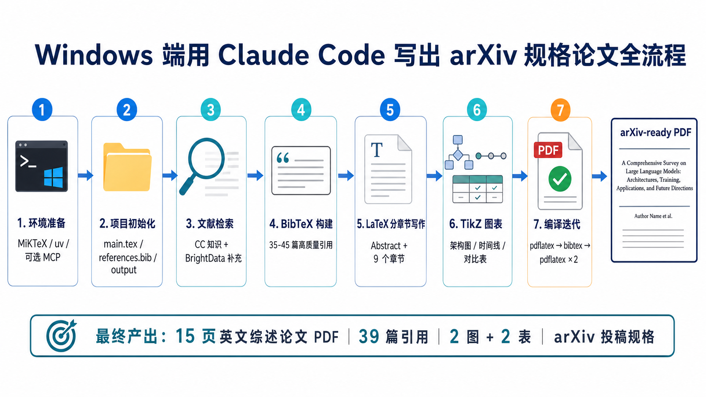

# academic-skill-eval

## 项目简介

本项目用于调研、测评和实战验证学术论文写作、文献综述、论文总结与科研辅助相关的 AI skills，首批测评对象主要来自 ClawHub。

项目最初目标是判断不同 academic skills 在真实科研工作流中的可用性；当前进一步扩展为：验证 Claude Code 是否可以在不依赖复杂 skill 生态的情况下，直接完成 arXiv 规格论文的选题、文献组织、LaTeX 写作、图表绘制、编译排错与 PDF 产出闭环。

## 当前核心结论

截至目前，项目已经形成一个重要实战结论：

> Claude Code 直接写 LaTeX 论文是可行的。对于标准英文综述论文，免费工具链已经足以支撑从论文结构设计、正文写作、BibTeX 引用、TikZ 图表到 PDF 编译的完整闭环；多数 paper-writing 类 skill 不是必要条件，真正的价值更可能体现在自动化、检索增强、质量检查和工作流封装上。

## 已完成的 arXiv 论文实战

本项目已经完成一次 Windows 端 Claude Code 写 arXiv 规格论文的完整实战。

- 论文主题：AI Agent 发展历程综述
- 论文标题：`From Symbolic Agents to LLM-Powered Autonomy: A Comprehensive Survey on the Evolution of AI Agents`
- 最终产出：15 页英文 PDF
- 引用数量：39 篇真实引用
- 图表：2 幅 TikZ 图 + 2 个 LaTeX 表格
- 结构：Abstract、Keywords、9 个正文章节、References
- 论文 PDF：`papers/agent-survey/output/agent-survey.pdf`
- LaTeX 主文件：`papers/agent-survey/main.tex`
- BibTeX 文献库：`papers/agent-survey/references.bib`

### Windows 端完整流程图



### 关键实践文档

- `papers/agent-survey/PRACTICE_GUIDE.md`
  Windows 端 Claude Code 写 arXiv 规格论文的完整实践指南，覆盖环境配置、LaTeX 模板、BibTeX、TikZ、编译排错和复现步骤。

- `papers/agent-survey/LINUX_LATEX_SETUP.md`
  Linux 云端 LaTeX 最小可行安装与验证方案，用于验证云服务器上运行 Claude Code 时是否能稳定完成论文编译闭环。

- `papers/agent-survey/PLAN.md`
  初始论文实战执行计划。

- `papers/agent-survey/lit_search_llm_agents.json`
  文献检索与整理过程中的中间数据。

## Windows 与 Linux 工作流定位

### Windows 实战链路

当前已经跑通的 Windows 端链路为：

```text
Claude Code
  → 设计论文方案
  → 构建 BibTeX 文献库
  → 编写 LaTeX 正文
  → 用 TikZ 绘制图表
  → MiKTeX 执行 pdflatex / bibtex 多轮编译
  → 读取日志并修复错误
  → 输出 arXiv 规格 PDF
```

Windows 端主要依赖 MiKTeX。关键经验包括：

- 需要开启 MiKTeX 自动安装宏包，避免编译时弹窗卡住。
- `newtxmath` 与 `amssymb` 可能出现 `\Bbbk` 冲突，需要在 LaTeX 中处理。
- 直接用 TikZ 写图，可以减少外部图片依赖。
- Claude Code 能够读取 `.log` 文件并修复 LaTeX 编译错误。

### Linux 云端目标链路

后续目标是让 Linux 云服务器上的 Claude Code 也能完成同样闭环：

```text
Ubuntu / Debian
  → TeX Live 子集
  → latexmk
  → BibTeX / TikZ
  → Claude Code 修改 tex/bib
  → 自动编译、读 log、修复、再编译
  → 输出 PDF
```

Linux 端推荐使用 TeX Live + `latexmk`，比 Windows GUI 式 MiKTeX 更适合命令行、服务器、CI/CD 和无人值守编译。

## skill 测评范围

当前已纳入评测范围的 9 个 skill：

- `literature-review`
- `academic-research-hub`
- `research-paper-writer`
- `paper-summarize-academic`
- `paper-writing-workflow`
- `daily-paper-digest`
- `zeelin-academic-paper`
- `thesis-helper`
- `paper-summary`

## skill 分类与测评思路

本项目不再采用“一刀切让所有 skill 都写同一篇论文”的测评方式，而是按 skill 类型分别设计任务。

当前分组如下：

### 搜索 / 检索型

- `literature-review`
- `academic-research-hub`
- `daily-paper-digest`

关注点：能否稳定检索论文、组织文献、输出可用引用信息和综述线索。

### 单篇总结 / 解析型

- `paper-summary`
- `paper-summarize-academic`

关注点：能否对单篇论文进行结构化总结、提炼方法、贡献、实验、局限和可复用观点。

### 写作 / 工作流型

- `research-paper-writer`
- `paper-writing-workflow`
- `zeelin-academic-paper`
- `thesis-helper`

关注点：能否真正推动论文成文，还是只适合作为大纲、润色、审查或辅助工具。

## 已观察到的 skill 结论

当前阶段的主要观察：

- `research-paper-writer` 当前实际实现为 stub，只返回成功消息和输入回显，无法实际生成论文正文。
- `paper-writing-workflow` 可以提供一定工作流帮助，但端到端论文产出仍需要 Claude Code 主导。
- `zeelin-academic-paper` 与检索类能力联动后可以辅助写作，但仍不能替代完整论文工程闭环。
- `thesis-helper` 更适合作为论文辅助工具箱，而不是自动写论文系统。
- `academic-writing-skills` 更适合论文后处理、投稿前审查和 reviewer 模拟。
- 当前 skill 生态的主要问题包括：依赖付费 API、脚本稳定性不足、端到端流程不完整。

## 新增论文写作 skill 子项目

项目新增并已发布 `arxiv-paper-writer` skill：

```text
skills/arxiv-paper-writer/
```

该 skill 用于沉淀 `papers/agent-survey` 实战中已经跑通的 Claude Code 写 arXiv 规格论文流程，包括 LaTeX 项目初始化、BibTeX 构建、分章节写作、TikZ 图表、编译排错和最终质量审查。当前已进一步按方案 B 选择性迁移 `papers/agent-survey` 的可复用资产，包含 9 章节 survey 模板、39 条真实 BibTeX 示例、TikZ/表格片段、Windows 实践指南、Linux TeX Live 指南和流程图资产。

当前发布状态：

- GitHub 独立仓库：`https://github.com/16Miku/arxiv-paper-writer-skill.git`
- 父项目接入方式：`skills/arxiv-paper-writer/` 已从普通目录迁移为 Git submodule
- ClawHub 页面：`https://clawhub.ai/16miku/arxiv-paper-writer`
- ClawHub 发布版本：`arxiv-paper-writer@0.1.0`
- ClawHub 发布 ID：`k97ekrsn8p00174pmzjf826pfd85gr5s`

## 目录结构

项目主要目录如下：

```text
.
├── CLAUDE.md
├── Memory.md
├── README.md
├── skills/
│   └── arxiv-paper-writer/
│       ├── SKILL.md
│       ├── templates/
│       ├── references/
│       ├── scripts/
│       ├── assets/
│       └── evals/
├── evaluations/
│   └── <skill-slug>/
│       ├── skill/
│       └── run/
└── papers/
    └── agent-survey/
        ├── main.tex
        ├── references.bib
        ├── PLAN.md
        ├── PRACTICE_GUIDE.md
        ├── LINUX_LATEX_SETUP.md
        ├── lit_search_llm_agents.json
        ├── image/
        │   └── generate_paper_flowchart.png
        └── output/
            └── agent-survey.pdf
```

说明：

- `evaluations/<skill-slug>/skill/`：通过 ClawHub CLI 下载的 skill 原始内容。
- `evaluations/<skill-slug>/run/`：该 skill 的测评任务、过程记录、输出结果和结论材料。
- `papers/agent-survey/`：Claude Code 写 arXiv 规格论文的完整实战目录。
- `skills/arxiv-paper-writer/`：从 Agent Survey 实战抽取出的论文写作 skill 子项目，已作为 Git submodule 接入父项目；独立仓库为 `https://github.com/16Miku/arxiv-paper-writer-skill.git`，ClawHub 页面为 `https://clawhub.ai/16miku/arxiv-paper-writer`，发布版本为 `arxiv-paper-writer@0.1.0`。
- `Memory.md`：项目持续记忆与进度板。

## 环境与工具约定

- 全部过程记录、结论说明与沟通统一使用中文。
- 当前系统中的 Python 由 `uv` 管理，涉及 Python 运行、依赖安装、测试执行时优先使用 `uv`。
- skill 搜索、下载与 inspect 优先使用 ClawHub CLI。
- Windows 端 LaTeX 实战使用 MiKTeX。
- Linux 云端 LaTeX 验证推荐 TeX Live + `latexmk`。
- Git 提交信息使用中文。
- 未经明确要求，不主动 push 到远端。

## 当前进度

已完成：

- 完成论文相关 skills 的初步调研。
- 创建并规范化 `evaluations/<skill-slug>/{skill,run}` 测评目录。
- 下载首批 9 个待测 skills。
- 完成多个检索型、写作型、辅助型 skill 的首轮测试。
- 跑通 Windows 端 Claude Code 写 arXiv 规格论文完整流程。
- 产出 15 页 Agent 发展历程综述论文 PDF。
- 编写 Windows 端完整实践指南 `PRACTICE_GUIDE.md`。
- 编写 Linux 云端 LaTeX 最小安装与验证文档 `LINUX_LATEX_SETUP.md`。
- 生成并加入 Windows 端论文写作流程图。
- 已规划、创建并发布 `arxiv-paper-writer` skill 子项目，用于把 `papers/agent-survey` 的 arXiv 论文写作实战流程沉淀为可复用 Claude Code skill；当前已推送到 GitHub 独立仓库 `https://github.com/16Miku/arxiv-paper-writer-skill.git`，父项目已通过 Git submodule 接入，并已发布到 ClawHub：`arxiv-paper-writer@0.1.0`。
- 完善 `.gitignore`，忽略 Claude Code 本地状态、Python 缓存、虚拟环境和 LaTeX 编译中间文件。

进行中：

- 继续沉淀各类 skill 的横向对比结论。
- 评估 Linux 云端 Claude Code 论文写作环境的可复现性。
- 将实战经验转化为可汇报、可复用的工作流文档。

待完成：

- 继续测试单篇总结 / 解析型 skill。
- 汇总各类型 skill 的阶段性对比结论。
- 对当前 Agent Survey 论文进行更高质量的学术增强，包括更完整文献覆盖、更强批判性分析、更高信息密度图表和更严格人工审校。
- 将最终结论持续同步到飞书汇报文档。

## 复现入口

如果要复现 Windows 端论文实战，优先阅读：

```text
papers/agent-survey/PRACTICE_GUIDE.md
```

如果要在 Linux 云服务器上验证 Claude Code + LaTeX 编译环境，优先阅读：

```text
papers/agent-survey/LINUX_LATEX_SETUP.md
```

如果要查看项目长期进度与关键结论，阅读：

```text
Memory.md
```
